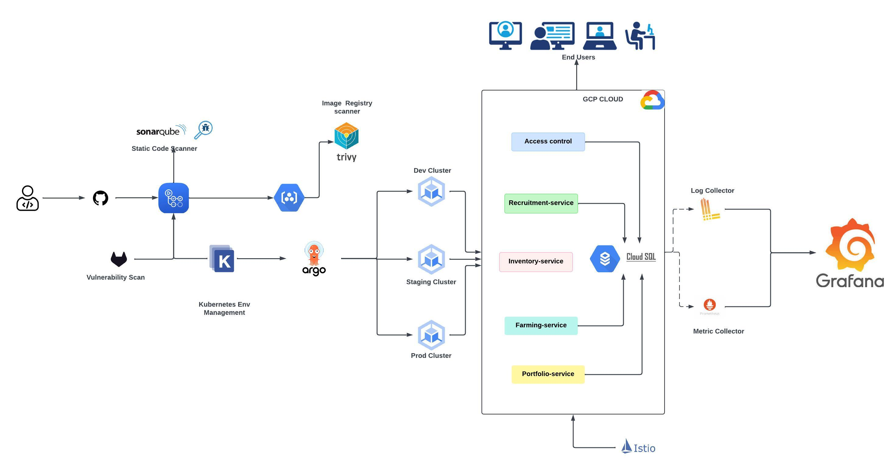

## Agric OS Redeployment to version-2



### Monitoring with Helm Chart
- Install Helm: Ensure Helm is installed.
- Add Repositories: Add the Prometheus, Grafana, and Loki Helm repositories.
- Create Namespace: Create a namespace for your monitoring tools.
- Deploy Prometheus: Use Helm to install Prometheus in the GKE cluster.
- Deploy Grafana: Use Helm to install Grafana in the GKE cluster.
- Configure Data Sources: Add Prometheus and Loki as data sources in Grafana.
- Create Dashboards and Alerts: Create dashboards in Grafana for metrics and logs and set up alerts as needed.


### Helm Command for moniroting

```
helm repo add ingress-nginx https://kubernetes.github.io/ingress-nginx
helm repo add prometheus-community https://prometheus-community.github.io/helm-charts
helm repo add grafana https://grafana.github.io/helm-charts
helm repo add loki https://grafana.github.io/loki/charts
helm repo update
helm search repo grafana
helm show value grafana/loki-stack > /data

kubectl create namespace monitoring

helm install prometheus prometheus-community/prometheus --namespace monitoring -f prometheus.yaml
helm install grafana grafana/grafana --namespace monitoring -f grafana.yaml
helm install loki grafana/loki-stack --namespace monitoring -f loki.yaml
helm install loki-stack grafana/loki-stack --namespace monitoring -f loki-stack.yaml

helm install ingress-nginx ingress-nginx/ingress-nginx --namespace monitoring -f ingress.yaml

 

kubectl port-forward svc/loki-stack-grafana -n monitoring 3000:80
kubectl port-forward svc/nginx-servic -n monitoring 80:80


```


### Create and run an environment for running GCloud Command 
```
# create an environment 
mkdir -p ~/.config/gcloud
python3.11 -m venv ~/.config/gcloud/virtenv

#Activate the env
source ~/.config/gcloud/virtenv/bin/activate

#Deactivate the Virtual Environment
deactivate

```

### Install Google Cloud SDK and plugins
```
# Download GCloud for Apply Silicon (M1) Macs
#!!! Please check other system configuration for downloud
curl -O https://dl.google.com/dl/cloudsdk/channels/rapid/downloads/google-cloud-sdk-478.0.0-darwin-arm.tar.gz

#Extract and Install
tar -xf google-cloud-sdk-xxx-darwin-*.tar.gz
./google-cloud-sdk/install.sh

#Initialize the SDK:
./google-cloud-sdk/bin/gcloud init

# Add to Google Cloud SDK to your PATH:
#!!! For Zsh:
echo 'source ~/google-cloud-sdk/path.zsh.inc' >> ~/.zshrc
echo 'source ~/google-cloud-sdk/completion.zsh.inc' >> ~/.zshrc
source ~/.zshrc

# Install gke-gcloud-auth-plugin and update
gcloud components install gke-gcloud-auth-plugin
gcloud components update

```

### Set Environment Variable
```
#Set the environment variable
export USE_GKE_GCLOUD_AUTH_PLUGIN=True

#Make it permanent:
echo 'export USE_GKE_GCLOUD_AUTH_PLUGIN=True' >> ~/.zshrc
source ~/.zshrc

```

### Verify Installation
```
#Update kubeconfig for your GKE cluster
gcloud container clusters get-credentials <your-cluster-name> --zone <your-cluster-zone>


#Test kubectl:
kubectl get pods

```


### Garfana Alert 
```
expr: sum(rate(container_cpu_usage_seconds_total{namespace="default", pod=~".*"}[1m])) by (pod) > 0.8
for: 5m
labels:
  severity: warning
annotations:
  summary: "High CPU usage detected in pod {{ $labels.pod }}"
  description: "Pod {{ $labels.pod }} in namespace {{ $labels.namespace }} has high CPU usage."

```


### Grafana.com dashboard id list:
Dashboard 	ID
k8s-addons-prometheus.json 	19105
k8s-addons-trivy-operator.json 	16337
k8s-system-api-server.json 	15761
k8s-system-coredns.json 	15762
k8s-views-global.json 	15757
k8s-views-namespaces.json 	15758
k8s-views-nodes.json 	15759
k8s-views-pods.json 	15760

### Functions of Grafana Alerts for Pods

    Monitoring Pod Health:
        CPU Usage: Monitor the CPU usage of pods and alert if usage exceeds a certain threshold.
        Memory Usage: Monitor the memory usage of pods and alert if usage exceeds a certain threshold.
        Pod Status: Check the status of pods (e.g., Running, Pending, Failed) and alert if a pod is in an unexpected state.

    Performance Metrics:
        Response Times: Monitor the response times of applications running in pods and alert if response times exceed acceptable limits.
        Error Rates: Monitor the rate of errors (e.g., HTTP 5xx status codes) generated by applications and alert if the error rate is too high.

    Resource Utilization:
        Disk Usage: Monitor disk usage of pods and alert if disk usage exceeds a certain threshold.
        Network Traffic: Monitor network traffic (e.g., bytes sent/received) and alert if unusual patterns are detected.

    Custom Metrics:
        Use custom metrics provided by your applications or Prometheus exporters to set up alerts for specific conditions relevant to your application.


        Define WAF rules based on your requirements (e.g., block SQL injection, XSS attacks, etc.)


